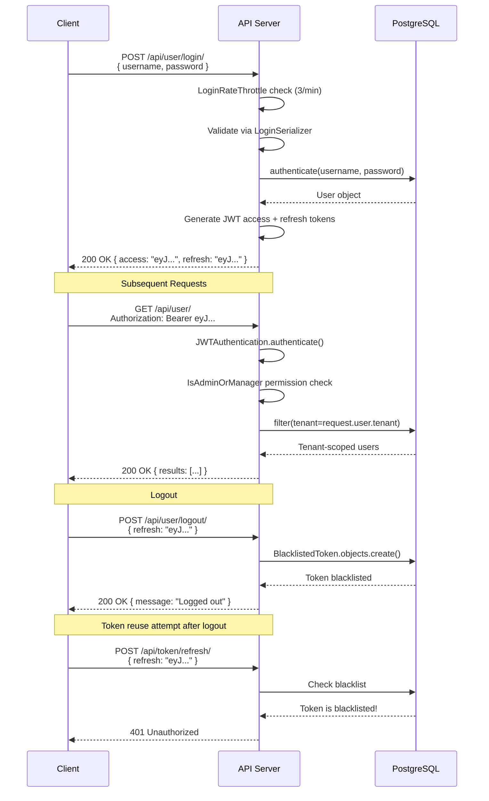
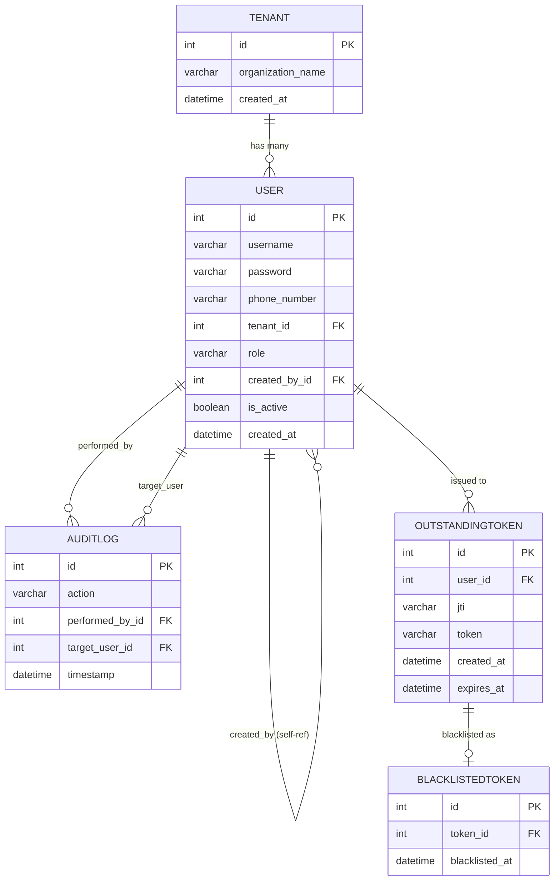
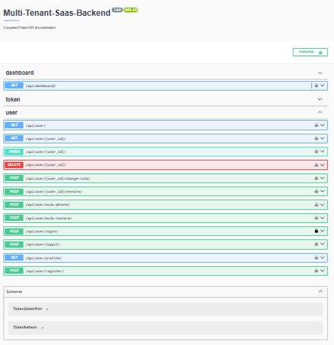
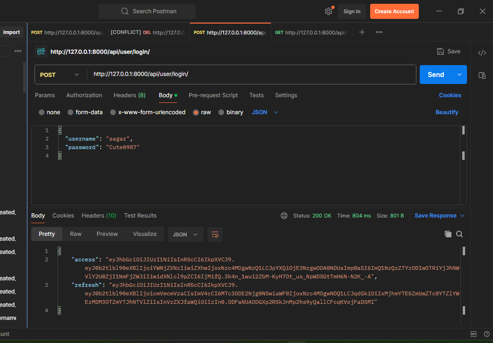
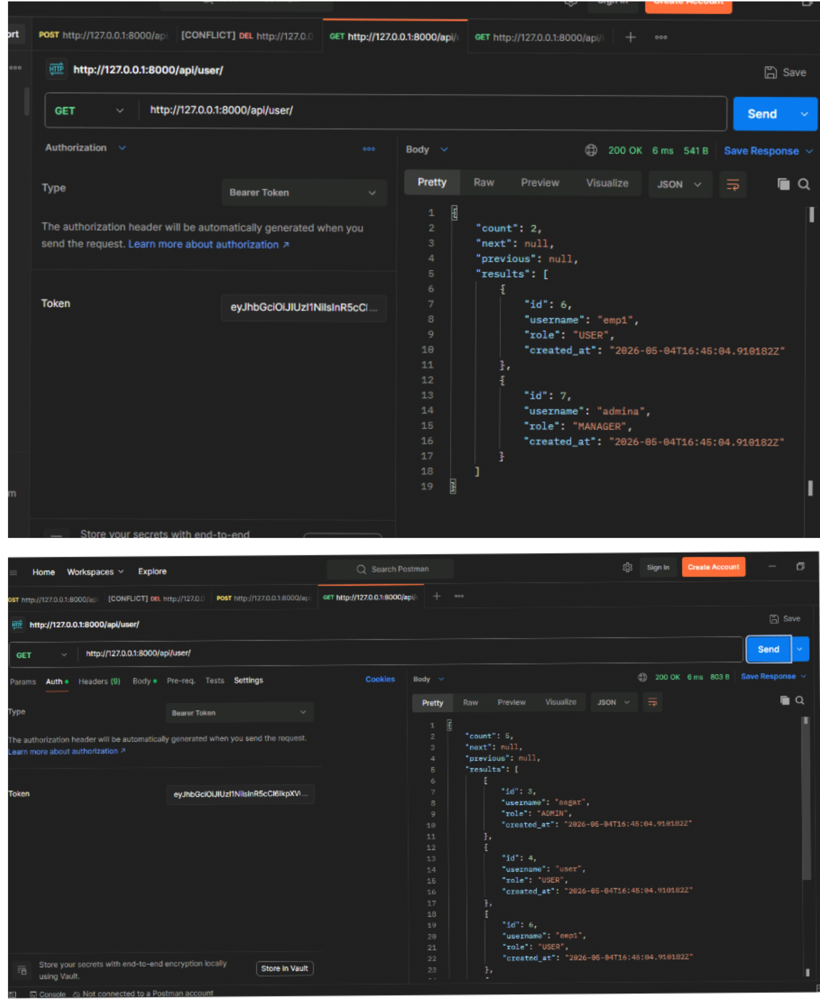
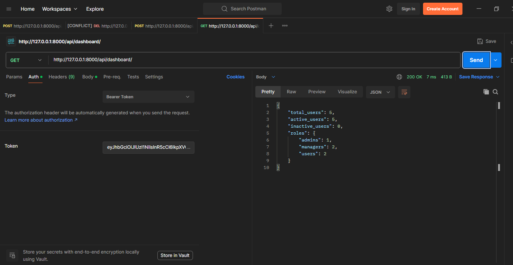
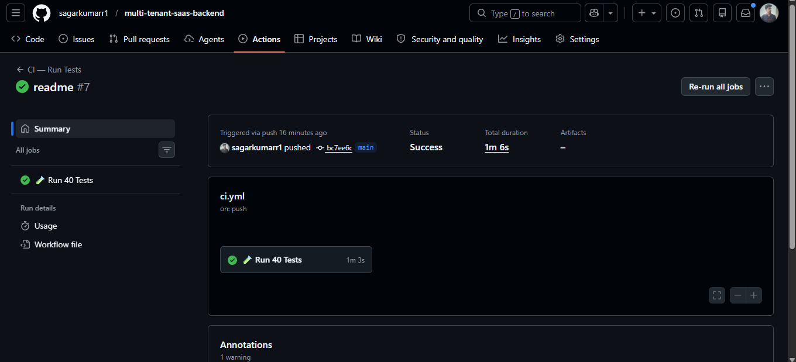
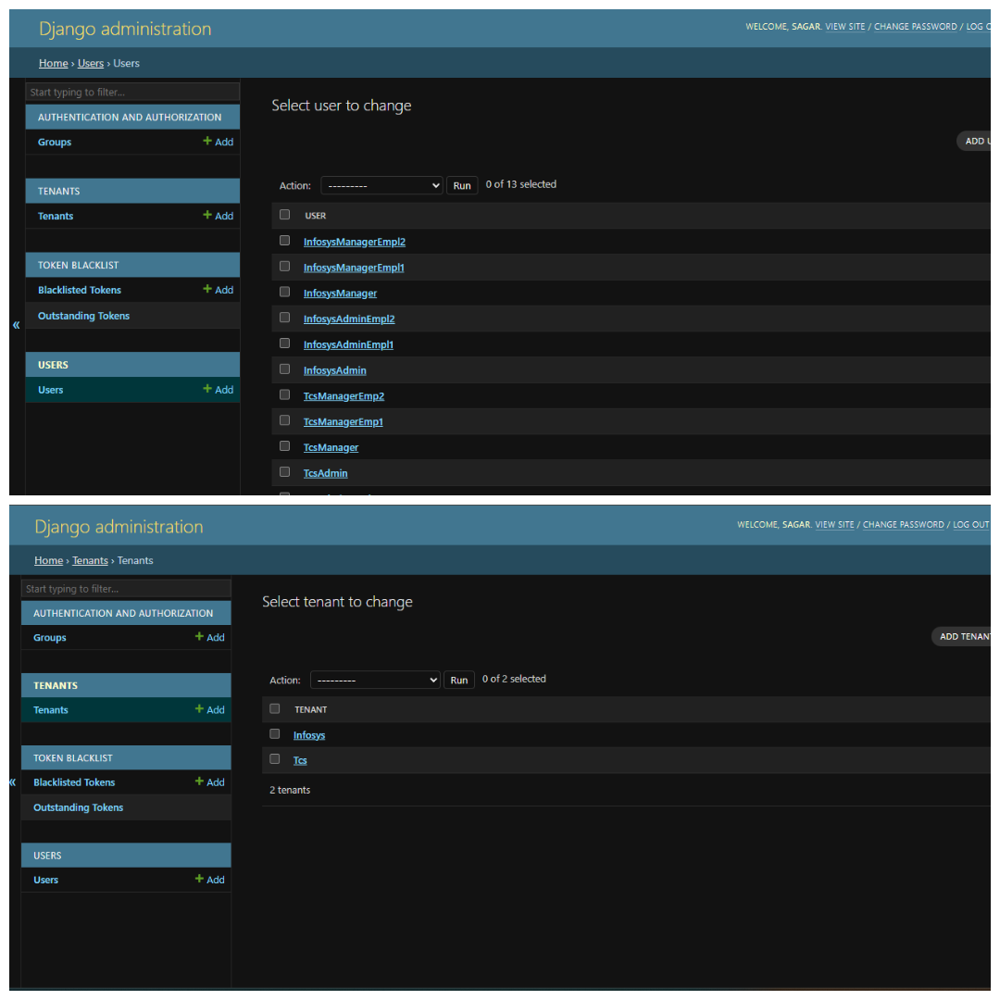

<div align="center">


<br/>

[](https://djangoproject.com)
[](https://www.django-rest-framework.org)
[](https://postgresql.org)
[](https://python.org)
[](#-running-tests)
[](https://github.com/sagarkumarr1/multi-tenant-saas-backend/actions)
[](https://multi-tenant-saas-backend-x74a.onrender.com/api/docs/)
[](LICENSE)

<br/>

### 🔗 Quick Links
[📖 **Live Swagger Docs**](https://multi-tenant-saas-backend-x74a.onrender.com/api/docs/) &nbsp;·&nbsp;
[📄 **ReDoc**](https://multi-tenant-saas-backend-x74a.onrender.com/api/redoc/) &nbsp;·&nbsp;
[🐛 **Report Bug**](https://github.com/sagarkumarr1/multi-tenant-saas-backend/issues) &nbsp;·&nbsp;
[⭐ **Star this repo**](https://github.com/sagarkumarr1/multi-tenant-saas-backend)

</div>

---

## 📌 Table of Contents

- [🎯 Project Overview](#-project-overview)
- [✨ Key Highlights](#-key-highlights)
- [🏗️ Architecture Diagram](#️-architecture-diagram)
- [🔐 Authentication Flow](#-authentication-flow)
- [🏢 Tenant Isolation](#-tenant-isolation)
- [🎭 RBAC Explanation](#-rbac--role-based-access-control)
- [🗄️ Database Schema / ER Diagram](#️-database-schema--er-diagram)
- [📡 API Endpoints](#-api-endpoints)
- [🖼️ Screenshots](#️-screenshots)
- [⚙️ Environment Setup](#️-environment-setup)
- [🚀 Deployment Guide](#-deployment-guide)
- [🧪 Running Tests](#-running-tests)
- [📁 Project Structure](#-project-structure)
- [🛠️ Tech Stack](#️-tech-stack)

---

## 🎯 Project Overview

> A **production-ready multi-tenant SaaS backend** where multiple organizations share the same infrastructure but have **completely isolated data**. Built with security-first principles — every endpoint authenticated, tenant-scoped, and role-protected.

This project solves a real-world problem: **how to build a single backend that serves many companies (tenants) without any data leakage between them.** Companies like Slack, Notion, and Jira all use this architecture.

```
Company A employees → can only see Company A's users
Company B employees → can only see Company B's users
           ↑                          ↑
    Same codebase          Same database
    Different data         Zero crossover
```

### ✅ What's Implemented

| Category | Feature | Status |
|---|---|:---:|
| **Auth** | JWT Login with access + refresh tokens | ✅ |
| **Auth** | Server-side logout via token blacklist | ✅ |
| **Auth** | Rate limiting — 3 login attempts/min | ✅ |
| **Multi-tenancy** | Complete data isolation between orgs | ✅ |
| **Multi-tenancy** | Cross-tenant attack prevention | ✅ |
| **RBAC** | 3-tier roles — Admin, Manager, User | ✅ |
| **RBAC** | Object-level permissions | ✅ |
| **Users** | Soft delete — deactivate, never hard-delete | ✅ |
| **Users** | Restore deleted users | ✅ |
| **Users** | Bulk delete & bulk restore | ✅ |
| **Users** | Search, filter by role, sort, paginate | ✅ |
| **Audit** | Full audit log — who did what, when | ✅ |
| **Dashboard** | Live tenant stats by role | ✅ |
| **Docs** | Auto-generated Swagger / ReDoc | ✅ |
| **Testing** | 45 tests — login, isolation, CRUD, bulk | ✅ |
| **CI/CD** | GitHub Actions on every push | ✅ |
| **Deploy** | Live on Render with PostgreSQL | ✅ |

---

## ✨ Key Highlights

<table>
<tr>
<td width="50%">

### 🔒 Security First
- Secrets via `.env` — never in code
- JWT blacklist logout
- Brute-force protection
- Cross-tenant isolation at DB level
- Object-level permissions

</td>
<td width="50%">

### 🏗️ Clean Architecture
- Custom `AbstractUser` model
- Serializer-level input validation
- `select_related()` to prevent N+1 queries
- Separation of concerns across apps
- Test settings isolated from production

</td>
</tr>
<tr>
<td width="50%">

### 📋 Audit Ready
- Every delete, restore, role change logged
- `AuditLog` records: actor + target + action + time
- Cannot be bypassed — writes in every view

</td>
<td width="50%">

### 🧪 Fully Tested
- 45 tests across 5 test classes
- Tenant isolation tested explicitly
- Permission matrix tested for all 3 roles
- CI runs on every `git push`

</td>
</tr>
</table>

---

## 🏗️ Architecture Diagram

```
╔══════════════════════════════════════════════════════════════════╗
║                        CLIENT LAYER                              ║
║         Postman  ·  Android App  ·  Browser  ·  cURL             ║
╚══════════════════════════════╤═══════════════════════════════════╝
                               │ HTTPS Requests
                               ▼
╔══════════════════════════════════════════════════════════════════╗
║              RENDER CLOUD  (Live Deployment)                     ║
║    https://multi-tenant-saas-backend-x74a.onrender.com           ║
╚══════════════════════════════╤═══════════════════════════════════╝
                               │
                               ▼
╔══════════════════════════════════════════════════════════════════╗
║                    GUNICORN  (WSGI Server)                       ║
╚══════════════════════════════╤═══════════════════════════════════╝
                               │
                               ▼
╔══════════════════════════════════════════════════════════════════╗
║                    DJANGO APPLICATION                            ║
║                                                                  ║
║  ┌────────────────────────────────────────────────────────────┐  ║
║  │  LAYER 1 — Django Middleware                               │  ║
║  │  Security · Session · CSRF · Auth · Clickjacking           │  ║
║  └────────────────────────────┬───────────────────────────────┘  ║
║                               │                                  ║
║  ┌────────────────────────────▼───────────────────────────────┐  ║
║  │  LAYER 2 — JWT Authentication + Rate Limiting              │  ║
║  │  JWTAuthentication     LoginRateThrottle  (3 req/min)      │  ║
║  │  UserRateThrottle (10/min)    AnonRateThrottle (5/min)     │  ║
║  └────────────────────────────┬───────────────────────────────┘  ║
║                               │                                  ║
║  ┌────────────────────────────▼───────────────────────────────┐  ║
║  │  LAYER 3 — RBAC Permission Layer                           │  ║
║  │  IsAdminOrManager (view-level)                             │  ║
║  │  IsOwnerOrAdmin   (object-level)                           │  ║
║  │  Tenant boundary enforcement on every query                │  ║
║  └────────────────────────────┬───────────────────────────────┘  ║
║                               │                                  ║
║  ┌────────────────────────────▼───────────────────────────────┐  ║
║  │  LAYER 4 — Serializer Validation                           │  ║
║  │  LoginSerializer · RegisterSerializer (duplicate check)    │  ║
║  │  BulkUserActionSerializer · LogoutSerializer               │  ║
║  └────────────────────────────┬───────────────────────────────┘  ║
║                               │                                  ║
║  ┌────────────────────────────▼───────────────────────────────┐  ║
║  │  LAYER 5 — Views (Business Logic)                          │  ║
║  │  LoginView  LogoutView  RegisterView  ProfileView          │  ║
║  │  UserListView  UserDetailView  RestoreUserView             │  ║
║  │  ChangeUserRoleView  BulkDeleteView  BulkRestoreView       │  ║
║  │  DashboardView                                             │  ║
║  └────────────────────────────┬───────────────────────────────┘  ║
║                               │                                  ║
╚══════════════════════════════╤═══════════════════════════════════╝
                               │ Django ORM
                               ▼
╔══════════════════════════════════════════════════════════════════╗
║                    POSTGRESQL DATABASE                           ║
║                                                                  ║
║   ┌─────────────┐    ┌──────────────┐    ┌──────────────────┐  ║
║   │   tenants   │◄───│    users     │───►│    audit_logs    │  ║
║   └─────────────┘    └──────────────┘    └──────────────────┘  ║
║                                                                  ║
║   ┌──────────────────────────────────────────────────────────┐  ║
║   │          token_blacklist (SimpleJWT)                     │  ║
║   │     outstanding_token  ·  blacklisted_token              │  ║
║   └──────────────────────────────────────────────────────────┘  ║
╚══════════════════════════════════════════════════════════════════╝
```

---

## 🔐 Authentication Flow

### Login → Access Protected Resource



### ASCII Version (for environments without Mermaid)

```
Client                      API Server                  Database
  │                              │                           │
  │── POST /user/login/ ────────►│                           │
  │   { username, password }     │── Rate limit check        │
  │                              │── Validate serializer     │
  │                              │── authenticate() ────────►│
  │                              │◄── User object ───────────│
  │                              │── Generate JWT tokens     │
  │◄── 200 { access, refresh } ──│                           │
  │                              │                           │
  │── GET /user/ ───────────────►│                           │
  │   Bearer eyJ...              │── Validate JWT            │
  │                              │── Check permissions       │
  │                              │── filter(tenant=...) ────►│
  │◄── 200 { results: [...] } ───│◄── Tenant users ──────────│
  │                              │                           │
  │── POST /user/logout/ ───────►│                           │
  │   { refresh: "eyJ..." }      │── Blacklist token ───────►│
  │◄── 200 "Logged out" ─────────│◄── Confirmed ─────────────│
```

---

## 🏢 Tenant Isolation

> **The core security guarantee:** A user from Tenant A can **never** read, modify, or delete data belonging to Tenant B — regardless of their role.

### How It's Enforced

Every query that touches user data is automatically scoped to the requesting user's tenant at the **database level** — not just filtered in Python:

```python
# ❌ VULNERABLE — No tenant isolation
users = User.objects.filter(id__in=user_ids)
# Admin from Tenant A could pass Tenant B user IDs → data breach!

# ✅ SECURE — Tenant-scoped at DB level
users = User.objects.filter(id__in=user_ids, tenant=request.user.tenant)
# Tenant A's IDs simply return empty for Tenant B → no data exposed
```

### Enforcement Points (Every Single One)

| View | Method | Isolation |
|---|---|---|
| `UserListView` | `GET` | `filter(tenant=request.user.tenant)` |
| `UserDetailView` | `GET PATCH DELETE` | `get_object_or_404(User, id=id, tenant=...)` via `IsOwnerOrAdmin` |
| `RestoreUserView` | `POST` | `get_object_or_404(User, id=id, tenant=request.user.tenant)` |
| `ChangeUserRoleView` | `POST` | `get_object_or_404(User, id=id, tenant=request.user.tenant)` |
| `BulkDeleteUserView` | `POST` | `filter(id__in=ids, tenant=request.user.tenant)` |
| `BulkRestoreUserView` | `POST` | `filter(id__in=ids, tenant=request.user.tenant)` |
| `DashboardView` | `GET` | `filter(tenant=request.user.tenant)` |

### Visual Model

```
┌──────────────────────────────┐     ┌──────────────────────────────┐
│          TENANT A            │     │          TENANT B            │
│       "TechCorp Ltd"         │     │      "StartupXYZ Inc"        │
│                              │     │                              │
│  👑 Admin (id=1)             │     │  👑 Admin (id=4)             │
│  👔 Manager (id=2)           │     │  👔 Manager (id=5)           │
│  👤 User A1 (id=3)           │     │  👤 User B1 (id=6)           │
│                              │     │  👤 User B2 (id=7)           │
│  tenant_id = 1               │     │  tenant_id = 2               │
└──────────────────────────────┘     └──────────────────────────────┘
          ↑                                      ↑
          │          ❌ HARD WALL ❌             │
          └──────────────────────────────────────┘
          Admin of Tenant A sends: DELETE /api/user/6/
          
          Server: get_object_or_404(User, id=6, tenant=TechCorp)
                                               └── TechCorp ≠ StartupXYZ
          Result: ─────────────────────────────────► 404 Not Found ✅
                  User 6 is completely safe.
```

### What Happens in a Real Cross-Tenant Attack

```bash
# Attacker: Admin of Tenant A
# Target: User id=99 from Tenant B

curl -X DELETE https://api.example.com/api/user/99/ \
  -H "Authorization: Bearer <Tenant_A_Admin_Token>"

# Response: 404 Not Found
# {  }
# Attacker gets NO information that user 99 even exists
```

---

## 🎭 RBAC — Role-Based Access Control

### Role Hierarchy

```
                    ┌─────────────────────┐
                    │       ADMIN         │
                    │   Full tenant access│
                    │   Can change roles  │
                    └──────────┬──────────┘
                               │ creates / manages
              ┌────────────────┴────────────────┐
              │                                 │
   ┌──────────▼──────────┐           ┌──────────▼──────────┐
   │       MANAGER       │           │       MANAGER       │
   │  Manages own users  │           │  Manages own users  │
   └──────────┬──────────┘           └─────────────────────┘
              │ creates
   ┌──────────┴──────────┐
   │        USER         │
   │  Self-access only   │
   └─────────────────────┘
```

### Permission Matrix

| Action | 👑 Admin | 👔 Manager | 👤 User |
|---|:---:|:---:|:---:|
| Login / Logout | ✅ | ✅ | ✅ |
| View own profile | ✅ | ✅ | ✅ |
| Update own username | ✅ | ✅ | ✅ |
| View **all** tenant users | ✅ | ❌ | ❌ |
| View **own created** users | ✅ | ✅ | ❌ |
| Create new user | ✅ | ✅ | ❌ |
| Delete **any** user | ✅ | ❌ | ❌ |
| Delete **own created** users | ✅ | ✅ | ❌ |
| Restore **any** user | ✅ | ❌ | ❌ |
| Restore **own created** users | ✅ | ✅ | ❌ |
| Change user role | ✅ | ❌ | ❌ |
| Bulk delete | ✅ | ✅ own only | ❌ |
| Bulk restore | ✅ | ✅ own only | ❌ |
| View dashboard | ✅ | ✅ | ❌ |
| Delete **self** | ❌ | ❌ | ❌ |
| Change **own** role | ❌ | ❌ | ❌ |

### Permission Classes (Source Code)

```python
# permissions.py

class IsAdminOrManager(BasePermission):
    """View-level gate — blocks Users from admin endpoints entirely."""
    def has_permission(self, request, view):
        if not request.user or not request.user.is_authenticated:
            return False
        return request.user.role in [User.ADMIN, User.MANAGER]


class IsOwnerOrAdmin(BasePermission):
    """Object-level gate — row-by-row access control."""
    def has_object_permission(self, request, view, obj):
        # Admin → access everything in their tenant
        if request.user.role == User.ADMIN:
            return True
        # Any user → access own profile only
        if obj == request.user:
            return True
        # Manager → access only users THEY created
        if request.user.role == User.MANAGER:
            return obj.created_by == request.user
        return False
```

---

## 🗄️ Database Schema / ER Diagram

### Mermaid ER Diagram



### ASCII ER Diagram (GitHub fallback)

```
┌─────────────────────┐
│       TENANT        │
├─────────────────────┤
│ id          (PK)    │
│ organization_name   │
│ created_at          │
└──────────┬──────────┘
           │ 1
           │ has many
           │ *
┌──────────▼──────────────────────────┐       ┌───────────────────────┐
│               USER                  │       │      AUDIT LOG        │
├─────────────────────────────────────┤       ├───────────────────────┤
│ id              (PK)                │       │ id            (PK)    │
│ username        UNIQUE              │──────►│ performed_by  (FK)    │
│ password        hashed              │       │ target_user   (FK)    │
│ phone_number    nullable            │◄──────│ action        VARCHAR │
│ tenant_id       (FK → TENANT)       │       │ timestamp             │
│ role            ADMIN/MANAGER/USER  │       └───────────────────────┘
│ created_by_id   (FK → self) ────────┐
│ is_active       default: True       │ Self-referential
│ created_at      auto                │ (Manager tracks created users)
└─────────────────────────────────────┘◄──────┘

┌─────────────────────────────────────┐
│        TOKEN BLACKLIST              │
├─────────────────────────────────────┤
│  OutstandingToken ── issued tokens  │
│  BlacklistedToken ── revoked tokens │
│  Used by LogoutView to invalidate   │
│  refresh tokens server-side         │
└─────────────────────────────────────┘
```

### Schema Design Decisions

| Decision | Reason |
|---|---|
| `AbstractUser` extended, not replaced | Keeps Django's auth system — passwords, sessions, admin all work |
| `is_active = False` for delete | Data never lost — fully restorable, audit trail preserved |
| `created_by` self-FK on User | Enables Manager-scoped queries without extra tables |
| `db_index=True` on `created_by` | Fast lookup: "all users this manager created" |
| `max_length=20` on `role` | "MANAGER" is 7 chars — leaves room for future roles |
| `max_length=100` on `action` | "CHANGE_ROLE_TO_MANAGER" = 22 chars — safe buffer |

---

## 📡 API Endpoints

**Base URL:** `https://multi-tenant-saas-backend-x74a.onrender.com/api/`

| # | Method | Endpoint | Auth | Role | Description |
|:---:|:---:|---|:---:|:---:|---|
| 1 | `POST` | `/user/login/` | ❌ | Public | Get JWT tokens |
| 2 | `POST` | `/user/logout/` | ✅ | Any | Blacklist refresh token |
| 3 | `POST` | `/user/register/` | ✅ | Admin / Mgr | Create user in tenant |
| 4 | `GET` | `/user/profile/` | ✅ | Any | Own profile + role |
| 5 | `GET` | `/user/` | ✅ | Admin / Mgr | List users (search, filter, sort) |
| 6 | `GET` | `/user/{id}/` | ✅ | Owner / Admin | User detail |
| 7 | `PATCH` | `/user/{id}/` | ✅ | Owner / Admin | Update username |
| 8 | `DELETE` | `/user/{id}/` | ✅ | Admin / Mgr | Soft delete |
| 9 | `POST` | `/user/{id}/restore/` | ✅ | Admin / Mgr | Restore deleted user |
| 10 | `POST` | `/user/{id}/change-role/` | ✅ | Admin only | Change role |
| 11 | `POST` | `/user/bulk-delete/` | ✅ | Admin / Mgr | Delete multiple |
| 12 | `POST` | `/user/bulk-restore/` | ✅ | Admin / Mgr | Restore multiple |
| 13 | `GET` | `/dashboard/` | ✅ | Admin / Mgr | Live tenant stats |
| 14 | `GET` | `/api/schema/` | ❌ | Public | OpenAPI 3.0 JSON |
| 15 | `GET` | `/api/docs/` | ❌ | Public | Swagger UI |
| 16 | `GET` | `/api/redoc/` | ❌ | Public | ReDoc UI |

### Query Parameters (User List)

```bash
GET /api/user/?search=john          # Username contains "john"
GET /api/user/?role=MANAGER         # Filter by role
GET /api/user/?ordering=username    # Sort A→Z
GET /api/user/?ordering=-created_at # Sort newest first (default)
GET /api/user/?page=2               # Page 2 (5 per page)
GET /api/user/?search=john&role=USER&ordering=username&page=1  # Combined
```

<details>
<summary><b>📋 All Request / Response Examples (Click to expand)</b></summary>

### POST /api/user/login/
```json
// Request
{ "username": "sagar", "password": "yourpassword" }

// 200 OK
{ "access": "eyJhbGciOiJIUzI1NiIsInR5cCI...", "refresh": "eyJhbGciOiJIUzI1..." }

// 401 Unauthorized
{ "error": "Invalid credentials" }

// 429 Too Many Requests (brute-force protection)
{ "detail": "Request was throttled. Expected available in 60 seconds." }
```

### POST /api/user/logout/
```json
// Request (with Authorization: Bearer <access_token>)
{ "refresh": "eyJhbGciOiJIUzI1NiIsInR5cCI..." }

// 200 OK
{ "message": "Logged out successfully. Token has been blacklisted." }

// 400 Bad Request (already used)
{ "error": "Invalid or already blacklisted token." }
```

### GET /api/user/
```json
// 200 OK
{
  "count": 12,
  "next": "http://api.example.com/api/user/?page=2",
  "previous": null,
  "results": [
    { "id": 3, "username": "john_doe", "role": "USER", "created_at": "2025-01-15T10:30:00Z" },
    { "id": 4, "username": "jane_smith", "role": "MANAGER", "created_at": "2025-01-14T09:00:00Z" }
  ]
}
```

### POST /api/user/bulk-delete/
```json
// Request
{ "user_ids": [3, 7, 12] }

// 200 OK
{
  "deleted": ["john_doe", "jane_smith"],
  "skipped": [{ "username": "yourself", "reason": "Cannot delete yourself" }]
}
```

### GET /api/dashboard/
```json
// 200 OK
{
  "total_users": 25,
  "active_users": 22,
  "inactive_users": 3,
  "roles": { "admins": 2, "managers": 5, "users": 18 }
}
```

### POST /api/user/{id}/change-role/
```json
// Request
{ "role": "MANAGER" }

// 200 OK
{ "message": "User role changed to MANAGER successfully" }

// 403 Forbidden (non-admin)
{ "error": "Only admins can change roles" }

// 404 Not Found (cross-tenant attempt)
{ "detail": "No User matches the given query." }
```

</details>

---

## 🖼️ Screenshots

### Swagger UI — API Documentation
> 📸 **Add Screenshot:** Visit `/api/docs/`, take a screenshot showing endpoint list
> 
> 

### Login Endpoint — Postman
> 📸 **Add Screenshot:** POST `/api/user/login/` with body and 200 response
>
> 

### User List — Paginated Response
> 📸 **Add Screenshot:** GET `/api/user/` showing paginated JSON response
>
> 

### Dashboard — Stats Response
> 📸 **Add Screenshot:** GET `/api/dashboard/` showing stats JSON
>
> 

### GitHub Actions — CI Tests Passing
> 📸 **Add Screenshot:** GitHub → Actions tab → green checkmark
>
> 

### Django Admin Panel
> 📸 **Add Screenshot:** `/admin/` showing Tenants, Users, AuditLogs
>
> 

> 💡 **To add screenshots:**
> ```bash
> mkdir screenshots
> # Add your .png files to the screenshots/ folder
> git add screenshots/
> git commit -m "docs: add API screenshots"
> ```

---

## ⚙️ Environment Setup

### Prerequisites

```
Python 3.12+     → python --version
PostgreSQL 14+   → psql --version
Git              → git --version
```

### Step 1 — Clone & Virtual Environment

```bash
git clone https://github.com/sagarkumarr1/multi-tenant-saas-backend.git
cd multi-tenant-saas-backend

# Create virtual environment
python -m venv venv

# Activate
source venv/bin/activate      # Mac / Linux
venv\Scripts\activate         # Windows
```

### Step 2 — Install Dependencies

```bash
pip install -r requirements.txt
```

### Step 3 — Environment Variables

```bash
cp .env.example .env
```

Open `.env` and fill in your values:

```env
# ─── Django ──────────────────────────────
SECRET_KEY=your-50-char-random-secret-key-here
DEBUG=True
ALLOWED_HOSTS=localhost,127.0.0.1

# ─── PostgreSQL ──────────────────────────
DB_NAME=saas_db
DB_USER=postgres
DB_PASSWORD=yourpassword
DB_HOST=localhost
DB_PORT=5432
```

> 💡 **Generate a strong SECRET_KEY instantly:**
> ```bash
> python -c "import secrets; print(secrets.token_urlsafe(50))"
> ```

### Step 4 — Database Setup

```bash
# Create PostgreSQL database
psql -U postgres -c "CREATE DATABASE saas_db;"

# Run all migrations
python manage.py makemigrations
python manage.py migrate

# Create superuser (Django admin access)
python manage.py createsuperuser
```

### Step 5 — Run Development Server

```bash
python manage.py runserver
```

| URL | What |
|---|---|
| `http://127.0.0.1:8000/admin/` | Django Admin Panel |
| `http://127.0.0.1:8000/api/docs/` | Swagger API Docs |
| `http://127.0.0.1:8000/api/redoc/` | ReDoc API Docs |

### Step 6 — Initial Tenant Setup

1. Open `http://127.0.0.1:8000/admin/`
2. **Create Tenant:** Tenants → Add → `organization_name = "TechCorp"`
3. **Configure Superuser:** Users → your user:
   - Set `tenant = TechCorp`
   - Set `role = ADMIN`
   - Save
4. **Test Login via Postman:**
   ```
   POST http://127.0.0.1:8000/api/user/login/
   Body: { "username": "yourusername", "password": "yourpassword" }
   ```
5. Copy the `access` token → use as `Authorization: Bearer <token>` in all other requests

---

## 🚀 Deployment Guide

### Deploy on Render (Free Tier)

#### Step 1 — Push to GitHub
```bash
git add .
git commit -m "feat: ready for deployment"
git push origin main
```

#### Step 2 — Create Web Service

1. [render.com](https://render.com) → **New → Web Service**
2. Connect your GitHub repository
3. Configure the service:

| Field | Value |
|---|---|
| **Name** | `multi-tenant-saas-backend` |
| **Runtime** | `Python 3` |
| **Build Command** | `pip install -r requirements.txt` |
| **Start Command** | `gunicorn config.wsgi` |
| **Plan** | Free |

#### Step 3 — Add Environment Variables

Render Dashboard → your service → **Environment** tab:

```
SECRET_KEY      → <generate a new strong key>
DEBUG           → False
ALLOWED_HOSTS   → your-app-name.onrender.com
DB_NAME         → <from Render PostgreSQL>
DB_USER         → <from Render PostgreSQL>
DB_PASSWORD     → <from Render PostgreSQL>
DB_HOST         → <from Render PostgreSQL>
DB_PORT         → 5432
```

#### Step 4 — Create PostgreSQL on Render

1. Render → **New → PostgreSQL**
2. Free tier → Create
3. Copy credentials to environment variables above

#### Step 5 — Run Migrations

Render → your service → **Shell** tab:
```bash
python manage.py migrate
python manage.py createsuperuser
python manage.py collectstatic --noinput
```

#### Step 6 — Verify

```bash
curl https://your-app.onrender.com/api/docs/
# Returns Swagger UI ✅
```

> ⚠️ **Free tier note:** Render free tier spins down after 15 min of inactivity.
> First request may take 30–60 seconds to wake up.

### Deployment Checklist

```
[ ] DEBUG=False in production
[ ] ALLOWED_HOSTS set to your domain only
[ ] SECRET_KEY is unique and secret (not the dev key)
[ ] PostgreSQL connected (not SQLite)
[ ] Migrations run on production DB
[ ] Static files collected
[ ] .env is in .gitignore (never committed)
```

---

## 🧪 Running Tests

### Install test dependencies
```bash
pip install pytest pytest-django
```

### Run all 45 tests
```bash
pytest users/tests.py -v
```

### Run a specific test class
```bash
pytest users/tests.py::LoginTests -v
pytest users/tests.py::TenantIsolationTests -v
pytest users/tests.py::PermissionTests -v
pytest users/tests.py::UserCRUDTests -v
pytest users/tests.py::LogoutTests -v
```

### Expected output
```
users/tests.py::LoginTests::test_valid_login_returns_tokens          PASSED
users/tests.py::LoginTests::test_wrong_password_returns_401          PASSED
users/tests.py::LoginTests::test_empty_credentials_returns_400       PASSED
...
users/tests.py::TenantIsolationTests::test_admin_a_cannot_change_role_of_tenant_b_user  PASSED
users/tests.py::TenantIsolationTests::test_bulk_delete_only_affects_own_tenant          PASSED
...
========================= 45 passed in 3.21s =========================
```

### Test Coverage by Class

| Class | Count | What's Covered |
|---|:---:|---|
| `LoginTests` | 8 | Valid/invalid login, empty fields, token auth, profile fields |
| `TenantIsolationTests` | 7 | Cross-tenant role change, bulk delete/restore, restore — all return 404 |
| `PermissionTests` | 12 | All 3 roles tested against every restricted endpoint |
| `UserCRUDTests` | 13 | Soft delete, restore, patch, bulk ops, edge cases, duplicate username |
| `LogoutTests` | 5 | Token blacklist, reuse prevention, unauthenticated, missing fields |
| **Total** | **45** | |

### CI — Automatic on every push

```yaml
# .github/workflows/ci.yml
on:
  push:
    branches: ["**"]   # Every branch
  pull_request:
    branches: [main]   # Every PR to main
```

---

## 📁 Project Structure

```
multi-tenant-saas-backend/
│
├── 📁 config/                      ← Django project config
│   ├── settings.py                 ← DB, JWT, DRF, Swagger, throttling
│   ├── settings_test.py            ← Test overrides (SQLite, no throttle)
│   ├── urls.py                     ← Root URLs + Swagger routes
│   ├── wsgi.py
│   └── asgi.py
│
├── 📁 core/                        ← Cross-app models
│   ├── models.py                   ← AuditLog model
│   ├── admin.py
│   └── migrations/
│
├── 📁 tenants/                     ← Tenant / Organization
│   ├── models.py                   ← Tenant model
│   ├── admin.py
│   └── migrations/
│
├── 📁 users/                       ← Main application
│   ├── models.py                   ← User (AbstractUser + tenant + role + created_by)
│   ├── serializers.py              ← Login, Register, Logout, BulkAction
│   ├── permissions.py              ← IsAdminOrManager, IsOwnerOrAdmin
│   ├── throttles.py                ← LoginRateThrottle
│   ├── views.py                    ← 11 view classes
│   ├── urls.py                     ← 12 named URL patterns
│   ├── tests.py                    ← 45 tests across 5 classes
│   ├── admin.py
│   └── migrations/
│
├── 📁 .github/
│   └── workflows/
│       └── ci.yml                  ← Auto-run tests on push
│
├── 📁 screenshots/                 ← Add your API screenshots here
│
├── .env                            ← 🔒 Local secrets (gitignored)
├── .env.example                    ← Template — safe to commit
├── .gitignore
├── conftest.py                     ← pytest setup
├── pytest.ini                      ← Points to settings_test.py
├── requirements.txt                ← All deps pinned
├── Procfile                        ← gunicorn config.wsgi
└── manage.py
```

---

## 🛠️ Tech Stack

| Technology | Version | Purpose |
|---|:---:|---|
| **Django** | 6.0.4 | Web framework |
| **Django REST Framework** | 3.17.1 | REST API layer |
| **SimpleJWT** | 5.5.1 | JWT auth + token blacklist |
| **drf-spectacular** | 0.28.0 | OpenAPI 3.0 / Swagger docs |
| **PostgreSQL** | 16 | Production database |
| **psycopg2-binary** | 2.9.10 | PostgreSQL Python adapter |
| **python-decouple** | 3.8 | `.env` variable loading |
| **gunicorn** | 25.3.0 | Production WSGI server |
| **pytest-django** | latest | Testing framework |
| **GitHub Actions** | — | CI/CD pipeline |
| **Render** | — | Cloud deployment platform |

---

## 🔒 Security Checklist

```
[✅] SECRET_KEY loaded from .env (python-decouple)
[✅] DEBUG=False enforced in production
[✅] ALLOWED_HOSTS restricted (not wildcard *)
[✅] JWT tokens blacklisted on logout (server-side)
[✅] Brute-force protection — 3 login attempts/min
[✅] Global rate limiting — 10 req/min authenticated
[✅] Tenant isolation — DB-level enforcement
[✅] Cross-tenant attacks return 404 (not 403)
[✅] Object-level permissions on every user object
[✅] Self-delete prevention
[✅] Duplicate username → clean 400 (not 500 crash)
[✅] Audit log on all destructive actions
[✅] .env in .gitignore — never committed
[✅] 45 security tests including isolation tests
```

---

<div align="center">

**Built by [Sagar Kumar](https://github.com/sagarkumarr1)**

[](https://github.com/sagarkumarr1)
[](https://github.com/sagarkumarr1/multi-tenant-saas-backend)

**⭐ If this project helped you, please give it a star!**

[🔝 Back to Top](#-multi-tenant-saas-backend)


</div>
