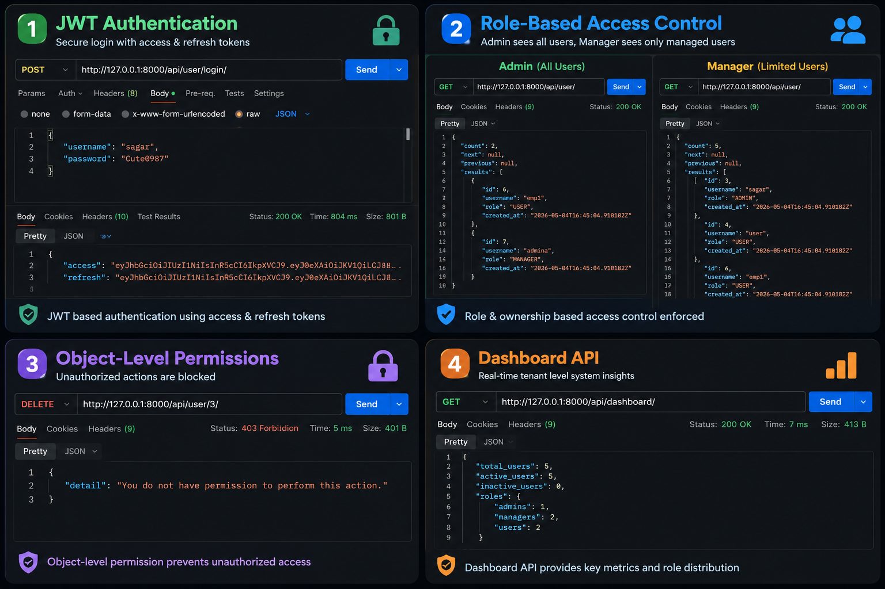
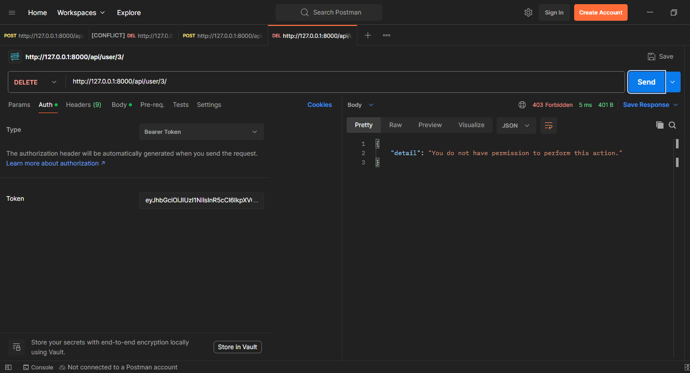

# 🚀 Multi-Tenant SaaS Backend (Django + DRF)



A production-ready multi-tenant SaaS backend built using Django REST Framework.

This project demonstrates how modern SaaS applications handle authentication, tenant isolation, role-based access control, object-level permissions, dashboard analytics, and API security.

---

# 📌 Overview

This backend simulates a real-world SaaS system where multiple organizations (tenants) use the same application while keeping their data completely isolated.

The project focuses on:

* Secure authentication
* Tenant-based architecture
* Role-based access control
* Object-level permissions
* Soft delete workflows
* Dashboard analytics
* API security & throttling

The goal of this project was not just building APIs, but understanding how scalable backend systems are designed in production.

---

# ✨ Features

## 🔐 Authentication

* JWT Authentication
* Access & Refresh Tokens
* Secure login flow
* Protected APIs

---

## 🏢 Multi-Tenant Architecture

* Each organization has isolated data
* No cross-tenant access
* Tenant-based filtering on every query

---

## 👥 Role-Based Access Control (RBAC)

### Roles

| Role    | Permissions          |
| ------- | -------------------- |
| Admin   | Full system access   |
| Manager | Manage created users |
| User    | Self-access only     |

---

## 🔒 Object-Level Permissions

* Ownership-based access control
* Managers can only access users created by them
* Unauthorized actions blocked automatically

---

## ♻️ Soft Delete & Restore

* Users are deactivated instead of permanently deleted
* Restore functionality available
* Prevents accidental data loss

---

## 📦 Bulk Operations

* Bulk delete users
* Bulk restore users
* Efficient admin actions

---

## 📊 Dashboard API

Provides:

* Total users
* Active users
* Inactive users
* Role distribution

---

## 🚦 Rate Limiting

* API throttling
* Brute-force protection
* Secure login endpoint

---

# 🛠️ Tech Stack

| Technology            | Usage                |
| --------------------- | -------------------- |
| Python                | Backend language     |
| Django                | Web framework        |
| Django REST Framework | API development      |
| Simple JWT            | Authentication       |
| SQLite                | Development database |
| Postman               | API testing          |

---

# 📸 Screenshots

## 🔐 JWT Authentication


---

## 👥 Role-Based Access Control


---

## ❌ Object-Level Permission Validation



---

## 📊 Dashboard API


---

# 🌐 Live API

```text
https://your-app.onrender.com
```

---

# 🧱 Architecture

* JWT Authentication
* Multi-Tenant Isolation
* RBAC (Role-Based Access Control)
* Object-Level Permissions
* Soft Delete System
* Audit Logging
* Dashboard Analytics
* Rate Limiting

---

# 🔄 API Request Flow

```text
Client
   ↓
JWT Authentication
   ↓
Permission Validation
   ↓
Views / Business Logic
   ↓
Django ORM
   ↓
Database
```

---

# 📡 API Examples

## 🔐 Login API

### Endpoint

```http
POST /api/user/login/
```

### Request

```json
{
  "username": "admin",
  "password": "123456"
}
```

### Response

```json
{
  "access": "jwt_access_token",
  "refresh": "jwt_refresh_token"
}
```

---

## 👥 Get Users

### Endpoint

```http
GET /api/user/
```

### Header

```text
Authorization: Bearer <token>
```

---

## 📊 Dashboard API

### Endpoint

```http
GET /api/dashboard/
```

### Response

```json
{
  "total_users": 5,
  "active_users": 5,
  "inactive_users": 0,
  "roles": {
    "admins": 1,
    "managers": 2,
    "users": 2
  }
}
```

---

# ⚙️ Installation

## 1️⃣ Clone Repository

```bash
git clone https://github.com/your-username/saas-backend.git
```

---

## 2️⃣ Move Into Project

```bash
cd saas-backend
```

---

## 3️⃣ Create Virtual Environment

```bash
python -m venv venv
```

---

## 4️⃣ Activate Virtual Environment

### Windows

```bash
venv\Scripts\activate
```

### Linux / Mac

```bash
source venv/bin/activate
```

---

## 5️⃣ Install Dependencies

```bash
pip install -r requirements.txt
```

---

## 6️⃣ Run Migrations

```bash
python manage.py makemigrations
python manage.py migrate
```

---

## 7️⃣ Run Server

```bash
python manage.py runserver
```

---

# 📚 Key Learning Outcomes

* Designing scalable backend systems
* Multi-tenant SaaS architecture
* Secure API development
* RBAC implementation
* Object-level permissions
* API security practices
* Production-oriented backend design

---

# 🚀 Future Improvements

* PostgreSQL integration
* Redis caching
* Swagger API documentation
* Celery background tasks
* Docker support
* React frontend integration
* Email verification

---

# 🤝 Connect

If you're interested in backend engineering or SaaS architecture, feel free to connect and share feedback.

---

# ⭐ Support

If you found this project useful, consider giving it a star ⭐
